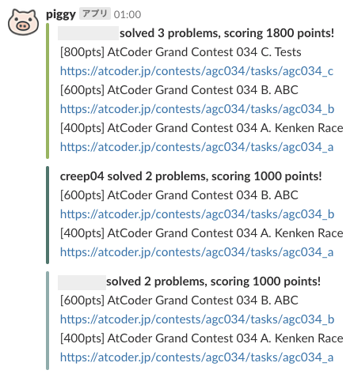
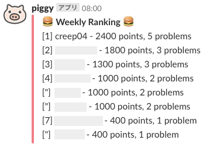

## 機能
- ユーザーのAtCoderへの提出を監視し、新しく問題をACしたらSlackに投稿する  
  

- 毎日/週/月解いた問題の総得点のランキングを投稿する  
  


## 使い方
1. ルートディレクトリ直下に _.env_ を作り、そこにIncoming WebhookのWebhook URLを以下のように記入
   ```
   WEBHOOK_URL='https://hooks.slack.com/services/wakuwaku/sample/o_O'
   ```

1. rails db:migrate

1. name: (監視対象のAtCoderID) としてUserを作成

1. cronやheroku schedulerで _lib/tasks/scheduler.rake_ のrakeタスクを定期的に実行
